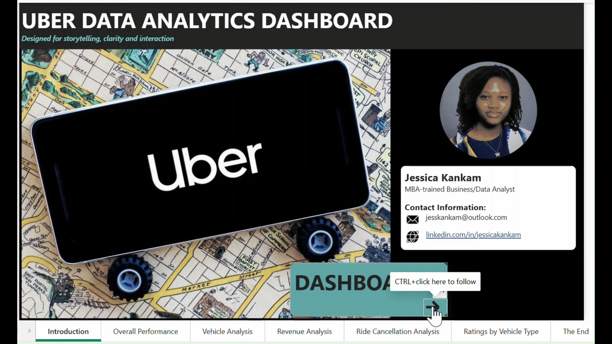

# Uber Ride Analysis Dashboard (Power BI)

## Business Problem
Ride-hailing platforms generate massive volumes of trip data, but actionable insights are often difficult to extract. This project transforms raw ride-level data into an interactive Power BI dashboard designed to support operational and revenue-driven decision-making.

## Objective
- Analyze ride demand, revenue, and completion trends
- Identify drivers of ride cancellations and inefficiencies
- Compare performance across vehicle types
- Explore customer and driver rating patterns

## Dashboard Demo

## Dashboard Pages
1. Overall Performance
2. Vehicle Analysis
3. Revenue Analysis
4. Ride Cancellation Analysis
5. Ratings by Vehicle Type

## Key Insights
- February shows unusually low ride volume, indicating potential seasonality or supply constraints
- Approximately 38% of bookings are cancelled or incomplete, representing a major operational challenge
- Driver-related issues are the leading cause of customer cancellations
- Uber Auto leads in both total bookings and revenue, while UberXL plays a niche role
- Customers rate drivers higher than drivers rate customers across all vehicle types

## Business Impact
This dashboard enables teams to:
- Monitor key ride KPIs in one place
- Identify operational bottlenecks and cancellation drivers
- Optimize vehicle allocation and pricing strategies
- Improve customer and driver experience

## Tools & Skills
- Power BI (data modeling, DAX measures, slicers)
- KPI design and dashboard storytelling
- Business and operations analytics

## Disclaimer
This is a personal portfolio project and is not affiliated with Uber.

